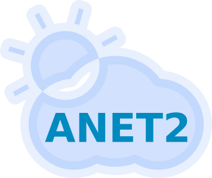

# AtmosphereNET 2.0: Neural network based probabilistic post-processing of ensemble weather forecasts

<p align="center">
    
</p>

**AtmosphereNET 2.0** (**ANET2**) is a state-of-the-art neural network algorithm for probabilistic ensemble weather forecast post-processing.
It is defined by the combination of a neural network architecture, denoted as **ANET2**, and a probabilistic, parametric forecast model.
The parametric forecast model can be one of three different approaches:

* Normal distribution (**ANET2 Norm**)
* Bernstein quantile regression (**ANET2 Bern**)
* Normalizing flows (**ANET2 Flow**)

Here, the postfix of either **Norm**, **Bern**, and **Flow** denotes the different parametric models used in conjunction with the **ANET2** neural network architecure
for its parameter estimation.

## Requirements

To train the ANET2 model the following Python libraries are required and can be installed with pip:
```console
pip3 install numpy==1.23.5 torch=1.13.1 netCDF4==1.6.2 xarray==2022.11.0
```

## Usage examples

To use the ANET2 repository for training, generating, and evaluating its models, first clone the repository
```console
git clone git@github.com:petermlakar/ANET2.git
```
after which, rename the included **config_template.json** file to **config.json**
```console
cd ANET2 && cp config_template.json config.json
```
The **config.json** file represents an interface to the framework, providing the training, generation, and evaluation scripts with the required information pertaining to training and test data paths, model variants, etc.

The following folder structure is recommended for this project:

```

ANET2
	|
	--- train.py
	|
	--- generate.py
	|
	--- evaluate.py
	|
	--- feature_importance.py
	|
	--- dataset.py 
	|
	--- config.json
	|
	--- config_template.json
	|
	--- models
	    |
	    --- ANET2.py
	    |
	    --- NORM.npy
	    |
	    --- BERN.npy
	    |
	    --- FLOW.npy
DATA
	|
	-- ESSD_benchmark_test_data_forecasts.nc
	|
	-- ESSD_benchmark_test_data_observations.nc
	|
	-- ESSD_benchmark_training_data_forecasts.nc
	|
	-- ESSD_benchmark_training_data_observations.nc

```
The instructions on how to download the dataset which can be used with this repository are provided in the next section.

### Training and test data

The training and test datasets, which can be used out-of-the-box with this repository, are accessible through the [EUPPBench dataset repository](https://github.com/EUPP-benchmark/ESSD-benchmark-datasets).
Following the instructions provided in the dataset repository produces the required training and test .nc (netCDF) files, required by the ANET2 dataset loader. Do **not** rename the downloaded .nc files as the dataset loader anticipates the names to follow the default EUPPBench naming convention, such as **ESSD_benchmark_test_data_forecasts.nc**.

### Training the model

The training script facilitates the training of three different **ANET2** variants, described in more detail in Mlakar et al., [2023](https://doi.org/10.48550/arXiv.2303.17610).
The three **ANET2** variants are:

* **Norm**: Normal distribution used as the parametric distribution model in conjunction with the **ANET2** parameter estimation network
* **Bern**: Bernstein quantile regression used as the parametric distribution model in conjunction with the **ANET2** parameter estimation network
* **Flow**: The **ANET2** variant using normalizing flows as parametric distribution models in conjunction with the **ANET2** parameter estimation network

To train a specific model one has to modify the **config.json** file appropriately.
Especially, one has to change the *dataPath* field and *training* object.
Here is an example of the required modification to train the **Flow** model
```json
	"dataPath": "/DATA",

	"training": 
	{
		"modelType": "FLOW", 
		"postfix": "FLOW_TEST",
		"residuals": true
	}
```
* The field *dataPath* should contain the absolute path to the folder containing the .nc training and test files.
* The field *modelType* under the *training* object denotes the type of **ANET2** model we wish to train using the data specified in *dataPath*.
* A value of *FLOW* denotes the normalizing flow based method. Two additional options include *BERN* and *NORM*, for Bernstein quantile regression and a normal predictive distribution, respectively.
* The field *postfix* under the *training* object denotes the optional postfix which will be appended to the output model's folder name, for easier differentiation between multiple runs.
* Finally, the boolean field *residuals* under the *training* object denotes whether the model should be trained on forecast errors or raw observations. A value of *true* denotes the former option.

To initiate the model training, run the **train.py** script
```console
python3 train.py
```

### Generate test forecasts

After training is completed one can inspect the resulting trained model files in a folder, which is stored in the current working directory and whose file depends on the parameters of the training run 
```console
trained_model_folder := <modelType>_<learningRate>_<batchSize>_<timestamp>_<postfix>
```
Since multiple model can be combined to form a single forecast it is required that the above folder is placed into a *parent model directory*, containing all models that one wishes to use as a quasi-ensemble. **If one wants to use only a single model for forecast generation, only a single trained_model_folder should be put in the parent directory.**

To generate the post-processed forecasts one has to modify the *generate* object in the **config.json** file.
Here is an example of the modified field
```json
	"generate":
	{
		"modelsPath": "ANET2/FLOW_MODELS",
		"outputPath": "FLOW_MODELS_GENERATED",
		"residuals": true,
		"averageParameters": false,
		"useBestModelOnly": false
	}
```
* The field *modelPath* specifies the absolute path to the *parent model directory* containing all the trained model which should be considered for the formation of forecast.
* The field *outputPath* specifies the absolute path to the folder which should contain the generated forecasts.
* The boolean field *residuals* should be set to *true* if the models pointed to by *trainPath* were trained on forecast residuals.
* The boolean field *averageParameters* denotes the way in which multiple forecast models should be combined. If set to *false* each model forms an independent probabilistic prediction in terms of quantiles. Then the final forecast is produced by averaging the respective quantiles from all model predictions. This procedure is recommended for the **Flow** model. If set to *true* the parameters of the individual distribution models are estimated and averaged to a single distribution model with which the quantile prediction is made. This is the preferred method for **Bern** and **Norm** models.
* The boolean field *useBestModelOnly* chooses the best model based on their validation dataset losses and uses only that model to produce the final forecast.

# Evaluation

To evaluate the model on the test dataset in terms of calibration and sharpness one can use the **evaluate.py** script.

## Publication

Peter Mlakar, Janko Merše, and Jana Faganeli Pucer. (2023). Ensemble weather forecast post-processing with a flexible probabilistic neural network approach.

Cite as:

```console
@misc{mlakar2023ensemble,
      title={Ensemble weather forecast post-processing with a flexible probabilistic neural network approach}, 
      author={Peter Mlakar and Janko Merše and Jana Faganeli Pucer},
      year={2023},
      eprint={2303.17610},
      archivePrefix={arXiv},
      primaryClass={cs.LG}
}
```
